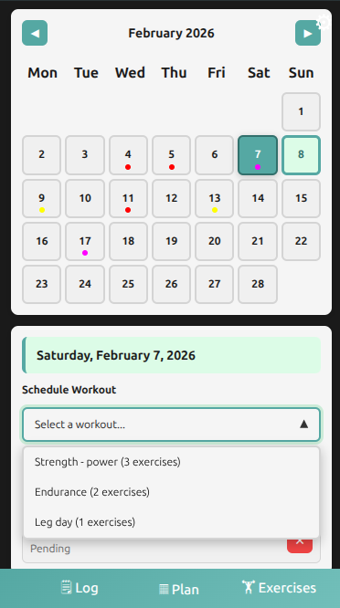
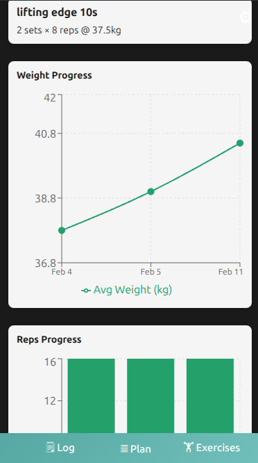
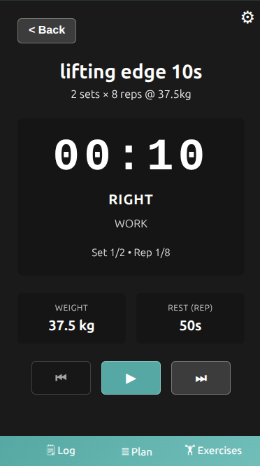

# Workout Tracker

An offline-first PWA for comprehensive workout management with cloud synchronization, analytics, and training planning. Built with React, Express, and Nx.

<div style="display: flex; gap: 20px;">
  
  
  
  
</div>

## ✨ Features

### Core Functionality

- **Exercise Management** – Create, edit, delete exercises with customizable sets, reps, and weights
- **Workout Planning** – Design workout routines and schedule them on a calendar
- **Live Session Tracking** – Track active workouts with real-time logging
- **Analytics** – View training progress with charts for volume, frequency, and performance
- **Offline-First** – Full functionality without internet via IndexedDB
- **Cloud Sync** – Backup to and restore from Google Drive using OAuth2

### User Experience

- **Icon-Based Navigation** – Context-aware action buttons (📊 Analytics, 📋 Plans, ⚙️ Settings)
- **Responsive Design** – Optimized for mobile (480px), tablet (768px), and desktop
- **Custom Components** – Specialized checkboxes, dropdowns, and modals
- **Glass-Morphism UI** – Modern visual design with CSS variables and smooth transitions

## 🏗️ Architecture

This is an **Nx monorepo** with a frontend + backend structure:

### Projects

| Project      | Purpose              | Tech                                      |
| ------------ | -------------------- | ----------------------------------------- |
| **apps/ui**  | React 19 SPA on Vite | React Router, TypeScript, Testing Library |
| **apps/bff** | Express API backend  | Node.js, esbuild, CORS enabled            |

### Key Architecture Decisions

1. **Task Dependencies**: `ui:serve` depends on `bff:serve` – both start together
2. **Data Flow**: UI → HTTP (localhost:3333) → BFF
3. **Persistence**: IndexedDB locally, Google Drive for cloud backup
4. **CORS**: BFF enables all origins for local development

## 🚀 Getting Started

### Prerequisites

- Node.js 22+
- npm

### Installation & Development

If Google drive data sync isn't required, then there's no need for any environment variables.
Otherwise, check `apps/bff/.env-sample` and `apps/ui/.env-sample` and create your own `.env` files.

```bash
# Install dependencies
npm install

# Start UI + BFF (automatically runs together)
npm run ui:serve
# UI runs on http://localhost:4200
# BFF runs on http://localhost:3333

# Or run BFF standalone
npm run bff:serve

# Build all projects
nx run-many -t build

# Build single app
nx build ui
nx build bff
```

### Environment

The BFF automatically enables CORS for all origins during development. No additional configuration needed for local testing.

## 🔧 Technology Stack

### Frontend

- **React 19** – UI framework with hooks
- **React Router v6** – Client-side routing
- **Vite** – Fast dev server & build tool
- **TypeScript** – Static typing
- **Dexie.js** – IndexedDB wrapper for local storage
- **Testing Library** – Component & hook testing
- **CSS Modules** – Scoped component styles

### Backend

- **Express.js** – Web framework
- **Node.js** – JavaScript runtime

### Build & Testing

- **Nx** – Monorepo orchestration with task caching
- **Vitest** – Unit & component test runner
- **Playwright** – E2E browser testing
- **ESLint** – Code quality
- **TypeScript Strict Mode** – Strict type checking

## 📊 Development Workflow

### Running Tasks

Use Nx commands for all operations:

```bash
# Run specific target
nx run <project>:<target>

# Run across multiple projects
nx run-many -t build

# Run affected projects (smart re-runs)
nx affected -t test

# View task graph
nx graph
```

## � Progressive Web App (PWA)

The app is fully configured as a PWA with offline support, installable on mobile and desktop.

### Features

- **Installable** – Add to home screen on Android, iOS, macOS, Windows, and Linux
- **Offline Capable** – Full functionality with service worker caching
- **App Shortcuts** – Quick access to Log, Exercises, and Workouts
- **App Screenshots** – Store listings with preview images

### Installation

#### Desktop (Chrome/Edge)

1. Visit `http://localhost:4200` or production URL
2. Click install button in address bar
3. App launches in standalone mode

#### Mobile

- **Android**: Menu (⋮) → Install app
- **iPhone**: Share → Add to Home Screen

## 📚 Resources

- [Nx Documentation](https://nx.dev)
- [React Router Docs](https://reactrouter.com)
- [Express Guide](https://expressjs.com)
- [Vitest Docs](https://vitest.dev)
- [Playwright Docs](https://playwright.dev)

## 📄 License

See LICENSE file for details.
